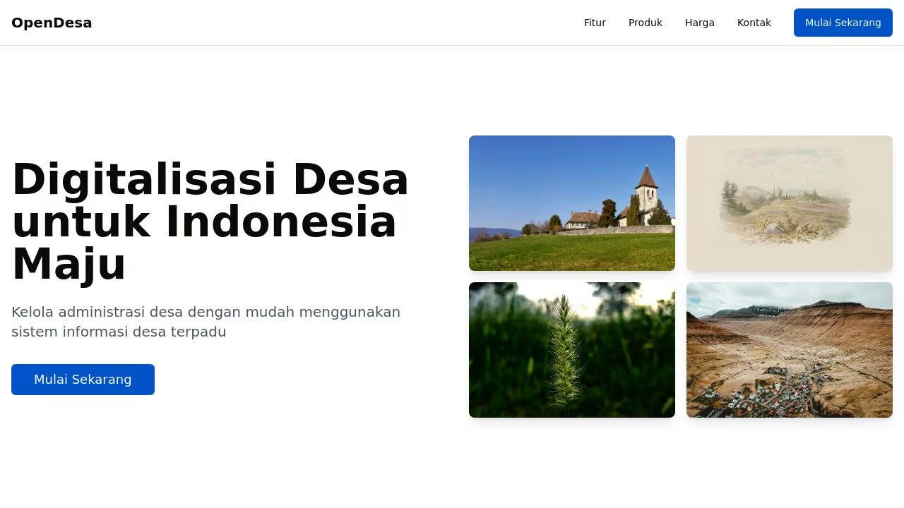
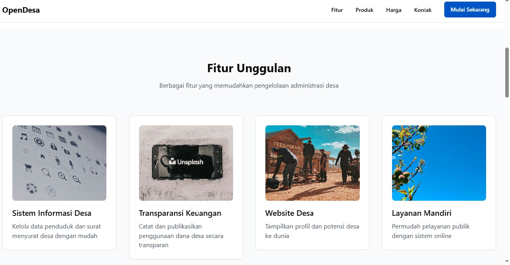
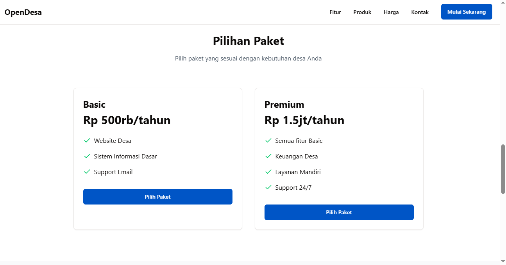

# OpenDesa ReactJS

OpenDesa adalah platform digitalisasi desa terpadu yang membantu pemerintah desa dalam mengelola administrasi dan pelayanan publik secara digital.

## 📸 Screenshot







## 🚀 Fitur

- **Sistem Informasi Desa**: Pengelolaan data penduduk dan surat menyurat desa
- **Transparansi Keuangan**: Pencatatan dan publikasi penggunaan dana desa
- **Website Desa**: Menampilkan profil dan potensi desa
- **Layanan Mandiri**: Sistem pelayanan publik online

## 💻 Tech Stack

- **Frontend**: React, TypeScript, TailwindCSS, Shadcn UI
- **Backend**: Express.js
- **Database**: PostgreSQL dengan Drizzle ORM
- **State Management**: TanStack Query
- **Routing**: Wouter
- **Animation**: Framer Motion

## 🛠️ Setup Development

### Prerequisites

- Node.js (v20 atau lebih baru)
- PostgreSQL

### Instalasi

1. Clone repository
```bash
git clone https://github.com/yourusername/opendesa.git
cd opendesa
```

2. Install dependencies
```bash
npm install
```

3. Setup environment variables
```bash
# Copy .env.example ke .env
cp .env.example .env
# Isi DATABASE_URL dan environment variables lainnya
```

4. Jalankan database migrations
```bash
npm run db:push
```

5. Jalankan development server
```bash
npm run dev
```

Aplikasi akan berjalan di `http://localhost:5000`

## 📝 Kontribusi

Kami sangat terbuka dengan kontribusi dari komunitas. Silakan buat pull request atau laporkan issues yang Anda temukan.

## 📧 Kontak

Untuk informasi lebih lanjut, silakan hubungi:
- Email: habizinnia@gmail.com

## 📄 Lisensi

Proyek ini dilisensikan di bawah MIT License - lihat file [LICENSE](LICENSE) untuk detail.
